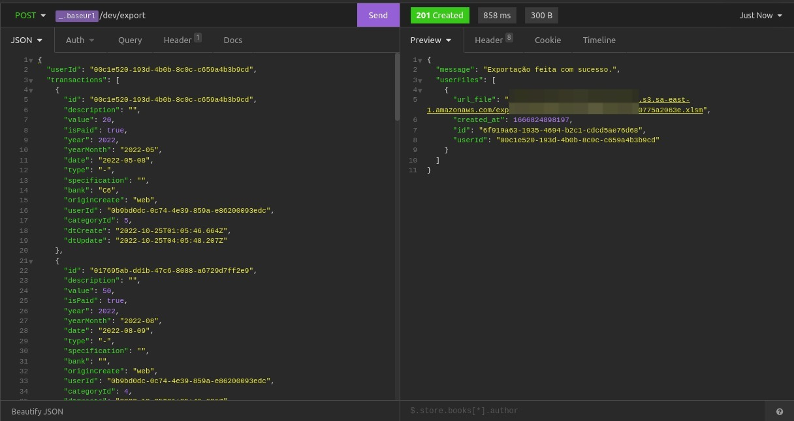

# Serverless - AWS Node.js Typescript

Criei essa aplicação com intuito de por em prática o que aprendi sobre serverless. O usuário vai poder enviar um array de objetos e a aplicação serverless irá converter em um arquivo excel, o arquivo será enviado para um bucket S3 (AWS) e os dados como userId e url_file será salvo no banco dynamodb.

## Demonstração



## 🛠 Tecnologias Utilizadas

    * Node
    * TypeScript
    * AWS
    * S3
    * Lambda
    * Serverless
    * Dyanamodb

## 🚀 Como executar?

### Variáveis de Ambiente

Para rodar esse projeto, você vai precisar adicionar as seguintes variáveis de ambiente no seu .env

`AWS_NAME_BUCKET`

`AWS_URL_BUCKET`

### Instalação

Caso não tenha o serverless instalado no seu computador e deseje executar na sua máquina, execute o seguinte comando.

```bash
    npm install -g serverless
```

```bash
    # instalar
    yarn install

    # Instalação do DynamoDB
    yarn db:install

    # Inicializar o DynamoDB
    yarn db:start

    # Configure seu aws-sdk
    serverless config credentials --provider aws --key=KEY_AWS --secret SECRET_KEY_AWS -o

    # Inicializar a aplicação
    yarn dev

```

### Deploy

```bash
    # Caso não tenha configurado antes, configure seu aws-sdk.
    serverless config credentials --provider aws --key=KEY_AWS --secret SECRET_KEY_AWS -o

   yarn deploy

```

## Documentação da API

#### Retorna todos os itens

```http
  POST /dev/exprt
```

JSON
| Parâmetro | Tipo | Descrição |
| :---------- | :--------- | :---------------------------------- |
| `userId` | `string` | **Obrigatório**. |
`transactions` | `object[]` | **Obrigatório**. Qualquer Array de objetos serve |

# Ref

This project has been generated using the `aws-nodejs-typescript` template from the [Serverless framework](https://www.serverless.com/).

For detailed instructions, please refer to the [documentation](https://www.serverless.com/framework/docs/providers/aws/).
